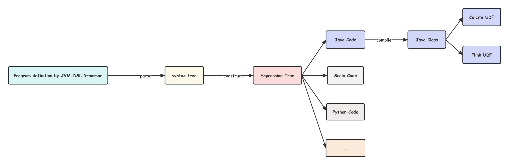

# JVM-DSL
一门通用的编程语言 具有函数式语法和面向对象语法 可在运行时转换为其他编程语言的语法文件 并编译为对应的可执行文件 在转换为JVM平台语言时 可用于各种计算框架的UDF编写 如Calcite和Flink等



### 语法

如下例子展现了基于JVM—DSl语法实现的代码逻辑 程序逻辑包裹在Program代码块中 在其中可任意定义类和方法 自定义类可以定义任意字段和方法 例子中定义了一个方法展现了部分语法细节

```
program{
   class ComplexNumber(Double real,Double image){
        def plus(ComplexNumber c)=ComplexNumber{
            return new ComplexNumber(c.real+real,c.image+image);
        }
        def sub(ComplexNumber c)=ComplexNumber{
            return new ComplexNumber(real-c.real,image-c.image);
        }
        def multi(ComplexNumber c)=ComplexNumber{
             return new ComplexNumber(real*c.real-image*c.image,image*c.real+real*c.image);
        }
        def toTuple()=(Double,Double){
           return (real,image);
        }
    }
    def eval(Array[(Double,Double)] a)=(Double,Double) throws Exception{
       ComplexNumber complexNumber = a.map((i,j)=>{
           return new ComplexNumber(i,j);
       }).reduce((i,j)=>{
         return i.multi(j);
       });
       return complexNumber.toTuple();
    }
}
```

### 实现

JVM-DSL的语法基于ANTLR4定义 [JVM-DSL语法定义](jvm-dsl-core/src/main/antlr4/com.dongjiaqiang.jvm.dsl.core/JvmDslParser.g4)

上述例子经过ANTLR4解析后生成抽象语法树 通过实现ANTLR4的语法树监听器接口 完成表达式树的构建 然后基于特定语言将表达式树翻译为对应的语言文件 语言文件可继续编译为相应的可执行文件

#### Java

Java语言实现基于Janino进行编译 编译后可动态加载为可执行模块

##### Calcite

该例子描述了在Calcite中运用由JVM-DSL编写的UDF [在Calcite中运用JVM-DSL实现的UDF](jvm-dsl-java/jvm-dsl-java-example/jvm-dsl-calcite/src/main/java/com/dongjiaqiang/jvm/dsl/calcite/Example.java)


